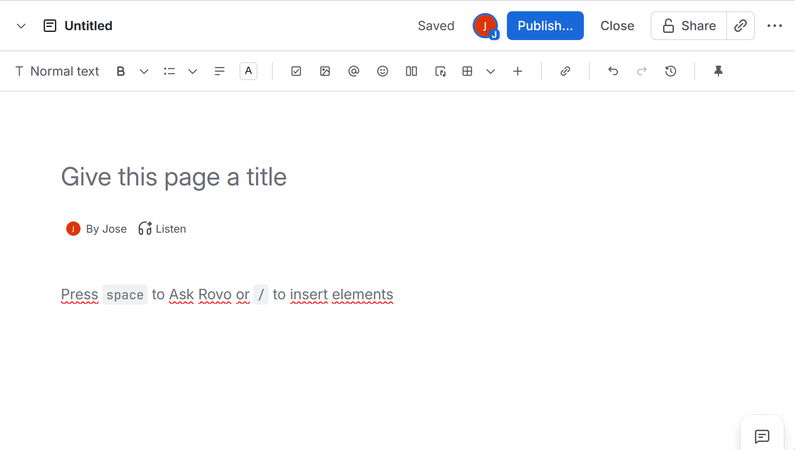
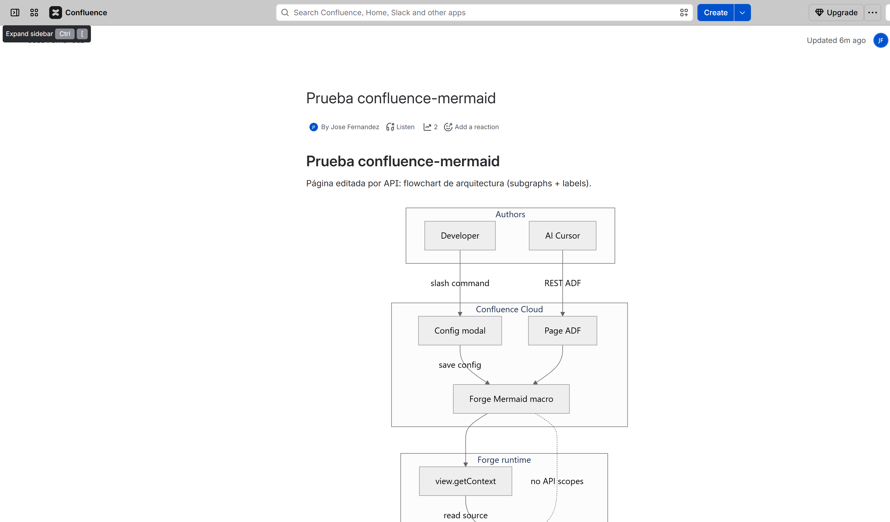
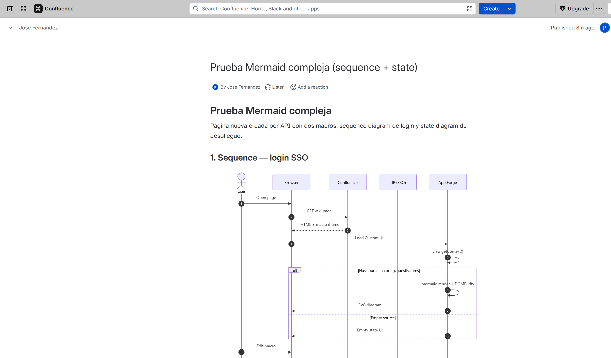
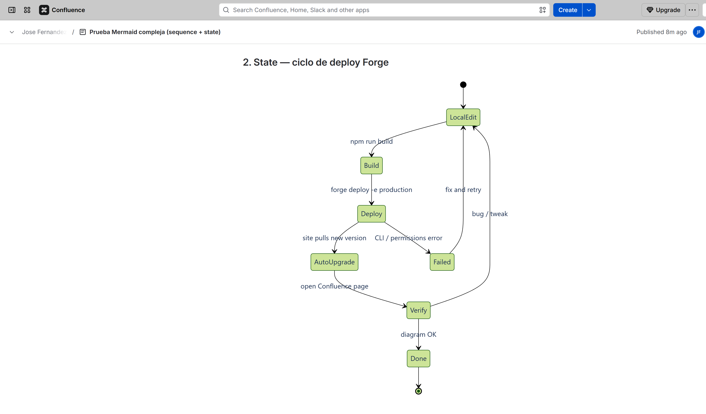

# confluence-mermaid

Free, open-source **Atlassian Forge** macro for **Confluence Cloud** that renders [Mermaid](https://mermaid.js.org/) diagrams **in the browser**.

- No backend functions
- No Confluence API scopes
- No external network calls
- Diagram source lives in macro **config** / **guestParams** — works for humans and AI/API inserts

## Requirements

- Node.js 20+
- An Atlassian account with access to a Confluence Cloud site
- [Forge CLI](https://developer.atlassian.com/platform/forge/getting-started/) (`npm i -g @forge/cli`)

## Quick start (contributors / testers)

```bash
git clone https://github.com/jfernandeze/confluence-mermaid.git
cd confluence-mermaid
npm run install:all
npm run build

forge login
forge register    # writes your app id into manifest.yml — do not commit someone else's id
forge deploy
forge install
```

When modules or permissions change later:

```bash
npm run build
forge deploy
forge install --upgrade
```

> **App id:** the repo ships with a placeholder `app.id`. Everyone who deploys must run `forge register` (or use their own id). Keep personal app ids out of PRs unless you own the published app.
>
> On many sites Forge **auto-upgrades** the installed app after `forge deploy` (admin shows *Up to date*). Use `forge install --upgrade` only if the site still shows an older version.

## Usage (humans)

1. Edit a Confluence page.
2. Type `/mermaid` and insert the **Mermaid** macro.
3. In the config modal, paste Mermaid source and pick a theme.
4. Save / publish.

<p align="center">
  
</p>

Editing an existing diagram is the same four steps: click the macro, change the text, publish.

Flowcharts, sequence diagrams and state machines, all rendered by the macro in a Confluence page — plus every other diagram type Mermaid 11 supports:

<p align="center">
  
</p>

<p align="center">
  
  &nbsp;
  
</p>

## For AI agents (Cursor / Claude)

The repo ships an Agent Skill that teaches models the exact ADF shape for this macro:

| Client | Path (auto-discovered in this repo) |
|---|---|
| Canonical | [`skills/confluence-mermaid/SKILL.md`](./skills/confluence-mermaid/SKILL.md) |
| Cursor | [`.cursor/skills/confluence-mermaid/SKILL.md`](./.cursor/skills/confluence-mermaid/SKILL.md) |
| Claude Code | [`.claude/skills/confluence-mermaid/SKILL.md`](./.claude/skills/confluence-mermaid/SKILL.md) |
| Team Marketplace plugin | [`plugins/confluence-mermaid/`](./plugins/confluence-mermaid/) |

Copy the folder into `~/.cursor/skills/` or `~/.claude/skills/` to use it outside this repo. Invoke with `/confluence-mermaid` or let the agent pick it up from the description.

`skills/confluence-mermaid/SKILL.md` is the canonical copy. Edit **only** that one, then mirror it into the client folders and the plugin:

```bash
npm run sync:skills
```

`npm run check:skills` fails if a mirror has drifted — useful in CI, since the plugin copy is what teammates actually receive.

**Company rollout (admin):** start with [docs/DISTRIBUTION.md](./docs/DISTRIBUTION.md) — it maps the two products (Forge app vs. skill) onto their channels. Per-channel detail:

- Claude Code plugin marketplace — [docs/TEAM-CLAUDE-MARKETPLACE.md](./docs/TEAM-CLAUDE-MARKETPLACE.md)
- Cursor Team Marketplace — [docs/TEAM-CURSOR-MARKETPLACE.md](./docs/TEAM-CURSOR-MARKETPLACE.md)
- claude.ai Organization skills — upload a zip of `skills/confluence-mermaid/`

Individual Claude Code users can add it directly:

```bash
/plugin marketplace add jfernandeze/confluence-mermaid
```

**Copy-paste prompt** (if you cannot load the skill):

```text
When adding Mermaid to Confluence on a site with confluence-mermaid installed,
insert a block ADF "extension" (not bodiedExtension). Use short extensionKey
APP_ID/ENV_ID/static/mermaid-diagram. Put the same Mermaid source string in both
parameters.guestParams.source and parameters.config.source. Do not prefix
extensionKey with ari:cloud:ecosystem::extension/. Prefer theme "neutral".
Avoid "/" inside Mermaid edge labels. Production test IDs:
APP_ID=efdf9273-2980-4c7b-9039-baf6371eb8da
ENV_ID=aa4638bc-29a8-4fd8-bbc9-634f11ccd440
```

## Usage (AI / Confluence API)

Insert a **block** Forge `extension` and put the Mermaid source in both `parameters.guestParams` and `parameters.config` (same fields the editor saves).

Important: use the **short** `extensionKey` (no `ari:cloud:ecosystem::extension/` prefix). The full ARI form often yields `Error loading the extension!` when inserted via API.

```json
{
  "type": "extension",
  "attrs": {
    "layout": "default",
    "extensionType": "com.atlassian.ecosystem",
    "extensionKey": "<APP_ID>/<ENV_ID>/static/mermaid-diagram",
    "parameters": {
      "forgeEnvironment": "PRODUCTION",
      "extensionId": "ari:cloud:ecosystem::extension/<APP_ID>/<ENV_ID>/static/mermaid-diagram",
      "extensionTitle": "Mermaid",
      "guestParams": {
        "theme": "neutral",
        "source": "flowchart LR\n  A[API] --> B[SVG]"
      },
      "config": {
        "theme": "neutral",
        "source": "flowchart LR\n  A[API] --> B[SVG]"
      }
    }
  }
}
```

For the published production install used in testing:

- `APP_ID` = `efdf9273-2980-4c7b-9039-baf6371eb8da`
- `ENV_ID` = `aa4638bc-29a8-4fd8-bbc9-634f11ccd440`

Avoid `/` inside edge labels when possible (`A -->|REST ADF| B` is safer than `A -->|REST / ADF| B` with Mermaid 11).

## Project layout

```
manifest.yml          Forge app descriptor (block macro, zero scopes)
static/shared/        Mermaid render + source extraction (config / guestParams)
static/view/          Macro view (page render)
static/config/        Edit diagram modal (source + theme + preview)
```

## Privacy model

The only declared permission is `content.styles: unsafe-inline`, which Mermaid needs for SVG `style` attributes. There is no `function` module, no `scopes`, and no `external` fetch — diagram data never leaves the Confluence page / reader browser via this app.

## Contributing

Issues and PRs are welcome. For local testing, use a Confluence Cloud developer site, keep `app.id` local to your Forge account, and describe the diagram types / browsers you verified.

## License

Apache-2.0
