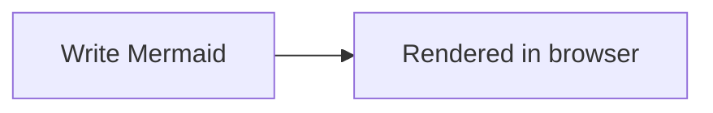

# confluence-mermaid

Free, open-source **Atlassian Forge** macro for **Confluence Cloud** that renders [Mermaid](https://mermaid.js.org/) diagrams **in the browser**.

- No backend functions
- No Confluence API scopes
- No external network calls
- Diagram source lives in the **macro body** (ADF) — works for humans and AI/API inserts

## Requirements

- Node.js 20+
- An Atlassian account with access to a Confluence Cloud site
- [Forge CLI](https://developer.atlassian.com/platform/forge/getting-started/) (`npm i -g @forge/cli`)

## Quick start (contributors / testers)

```bash
git clone https://github.com/jfernandeze/confluence-mermaid.git
cd confluence-mermaid
npm run install:all
npm run build

forge login
forge register    # writes your app id into manifest.yml — do not commit someone else's id
forge deploy
forge install
```

When modules or permissions change later:

```bash
npm run build
forge deploy
forge install --upgrade
```

> **App id:** the repo ships with a placeholder `app.id`. Everyone who deploys must run `forge register` (or use their own id). Keep personal app ids out of PRs unless you own the published app.

## Usage (humans)

1. Edit a Confluence page.
2. Type `/mermaid` and insert the **Mermaid** macro.
3. Inside the macro body, add a Mermaid code block:

````markdown

````

4. Publish. Optional: open macro settings to pick a theme.

## Usage (AI / Confluence API)

Insert a **bodied** Forge macro whose body contains a `mermaid` code block. Example ADF shape:

```json
{
  "type": "bodiedExtension",
  "attrs": {
    "layout": "default",
    "extensionType": "com.atlassian.ecosystem",
    "extensionKey": "ari:cloud:ecosystem::extension/<APP_ID>/<ENV_ID>/static/mermaid-diagram",
    "parameters": {
      "localId": "<uuid>",
      "extensionId": "ari:cloud:ecosystem::extension/<APP_ID>/<ENV_ID>/static/mermaid-diagram",
      "extensionTitle": "Mermaid"
    }
  },
  "content": [
    {
      "type": "codeBlock",
      "attrs": { "language": "mermaid" },
      "content": [
        { "type": "text", "text": "flowchart LR\n  A --> B" }
      ]
    }
  ]
}
```

Custom-config-only macros (source stored only in `parameters.config`) are unreliable via API and are no longer the primary path.

## Project layout

```
manifest.yml          Forge app descriptor (bodied macro, zero scopes)
static/shared/        Mermaid render + ADF body extraction
static/view/          Macro view (page render)
static/config/        Theme settings modal
```

## Privacy model

The only declared permission is `content.styles: unsafe-inline`, which Mermaid needs for SVG `style` attributes. There is no `function` module, no `scopes`, and no `external` fetch — diagram data never leaves the Confluence page / reader browser via this app.

## Contributing

Issues and PRs are welcome. For local testing, use a Confluence Cloud developer site, keep `app.id` local to your Forge account, and describe the diagram types / browsers you verified.

## License

Apache-2.0
